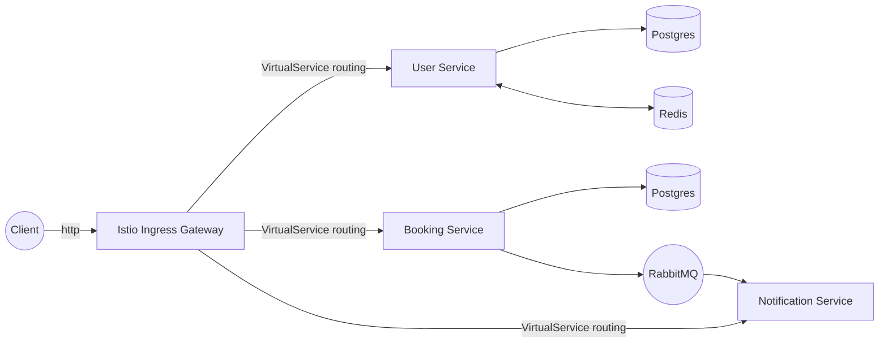

# Cloud-Native Appointment Tracker System

Система микросервисной архитектуры для управления записью клиентов в салон красоты. Проект спроектирован с упором на отказоустойчивость, безопасность и наблюдаемость (observability) в среде **Kubernetes**.

## 🏗️ Архитектура (Modernized)

Система развернута в кластере Kubernetes с использованием **Istio Service Mesh**. Вместо классического Java API Gateway маршрутизация трафика осуществляется на уровне Ingress Gateway через `VirtualService`, что является современным стандартом для Cloud-Native систем.



## 🚀 Основные особенности

- **Kubernetes-native**: Развертывание осуществляется через Helm-чарты.
- **Service Mesh (Istio)**: Управление трафиком, отказоустойчивость (retries, timeouts), безопасность (mTLS).
- **Istio-as-Gateway**: Маршрутизация внешнего трафика напрямую в микросервисы средствами Service Mesh.
- **Event-Driven Notifications**: Использование RabbitMQ для асинхронной отправки уведомлений о записях.
- **Observability**: Полный стек мониторинга (Prometheus, Grafana, Loki).

## 🛠️ Технологический стек

*   **Core**: Java 21, Spring Boot 3
*   **Infrastructure**: Kubernetes, Helm, Istio (Service Mesh)
*   **Messaging**: RabbitMQ
*   **Database**: PostgreSQL
*   **Caching**: Redis
*   **Observability**: Prometheus, Grafana, Loki

## ⚙️ Инструкция по развертыванию

1. **Подготовка кластера**:
   Убедитесь, что у вас запущен кластер Kubernetes (например, Minikube).

2. **Установка Istio**:
   Используйте локальный бинарный файл `istioctl` из директории `istio-1.23.0`:
   ```bash
   istioctl install --set profile=demo -y
   kubectl label namespace default istio-injection=enabled
   ```

3. **Сборка и загрузка образов**:
   Соберите образы для сервисов и загрузите их в Minikube:
   ```bash
   # Пример для user-service
   docker build --target user-service -t user-service:latest .
   minikube image load user-service:latest
   ```

4. **Установка Helm-чарта**:
   ```bash
   helm install salon-app ./salon-chart/
   ```

5. **Доступ к системе**:
   Запустите туннель для доступа к Ingress Gateway:
   ```bash
   minikube tunnel
   ```
   Система будет доступна по адресу `http://localhost/api/...`

## 📄 Дополнительно
Данный проект является демонстрацией навыков проектирования современных распределенных систем, перенесенных с legacy-инфраструктуры (Docker Compose) на Kubernetes + Service Mesh.
