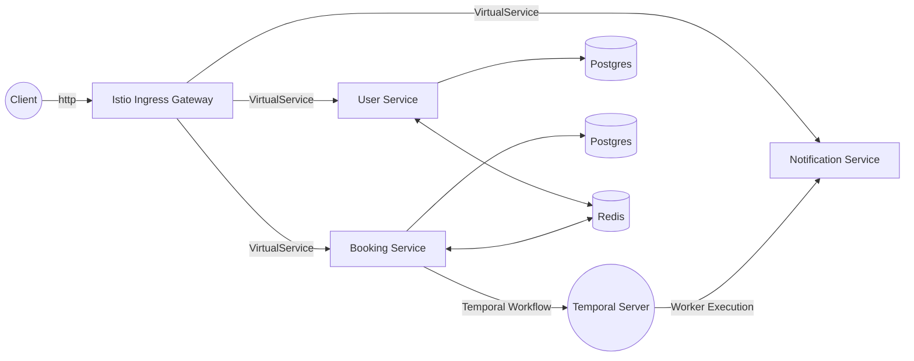

# Cloud-Native Appointment Tracker System

Система микросервисной архитектуры для управления записью клиентов в салон красоты. Проект спроектирован с упором на отказоустойчивость, безопасность и надежность оркестрации в среде **Kubernetes**.

## 🏗️ Архитектура (Modernized)

Система развернута в кластере Kubernetes с использованием **Istio Service Mesh**. Вместо классического API Gateway и брокеров сообщений для синхронизации, оркестрация бизнес-процессов реализована на **Temporal**. Трафик управляется через Istio Ingress Gateway.



## 🚀 Основные особенности

- **Kubernetes-native**: Развертывание полностью управляется через Helm-чарты.
- **Service Mesh (Istio)**: Управление трафиком, mTLS (безопасное общение между сервисами), observability.
- **Temporal Orchestration**: Надежная оркестрация асинхронных бизнес-процессов (уведомления) с автоматическими ретраями и гарантией доставки.
- **Istio-as-Gateway**: Маршрутизация внешнего трафика напрямую в микросервисы средствами Istio VirtualService.
- **Observability**: Интегрированный стек мониторинга (Prometheus, Grafana, Loki).

## 🛠️ Технологический стек

*   **Core**: Java 21, Spring Boot 3
*   **Orchestration**: Temporal (Workflow & Activities)
*   **Infrastructure**: Kubernetes, Helm, Istio
*   **Database**: PostgreSQL
*   **Caching**: Redis
*   **Observability**: Prometheus, Grafana, Loki

## ⚙️ Инструкция по развертыванию

1. **Подготовка кластера**:
   Убедитесь, что у вас запущен кластер Kubernetes (например, Minikube).

2. **Установка Istio**:
   ```bash
   istioctl install --set profile=demo -y
   kubectl label namespace default istio-injection=enabled
   ```

3. **Развертывание Temporal**:
   Для локальной разработки используйте образ `temporalio/temporal` в режиме `server start-dev`.

4. **Установка приложения**:
   ```bash
   helm install salon-app ./salon-chart/
   ```

5. **Доступ к системе**:
   Запустите туннель Minikube для доступа к Ingress Gateway:
   ```bash
   minikube tunnel
   ```
   Система будет доступна по адресу `http://localhost/api/...`

## 🛡️ Инженерные решения
*   **Temporal вместо RabbitMQ**: Переход на Temporal позволил отказаться от сложной логики очередей и ручной реализации компенсирующих транзакций, обеспечив "надежную доставку по определению".
*   **Transactional Outbox (теория)**: В перспективе развития проекта рассматривается внедрение паттерна для обеспечения строгой атомарности операций БД и внешних вызовов.
*   **Service Mesh**: Использование Istio позволило вынести логику маршрутизации и безопасности из кода микросервисов в инфраструктурный слой.
