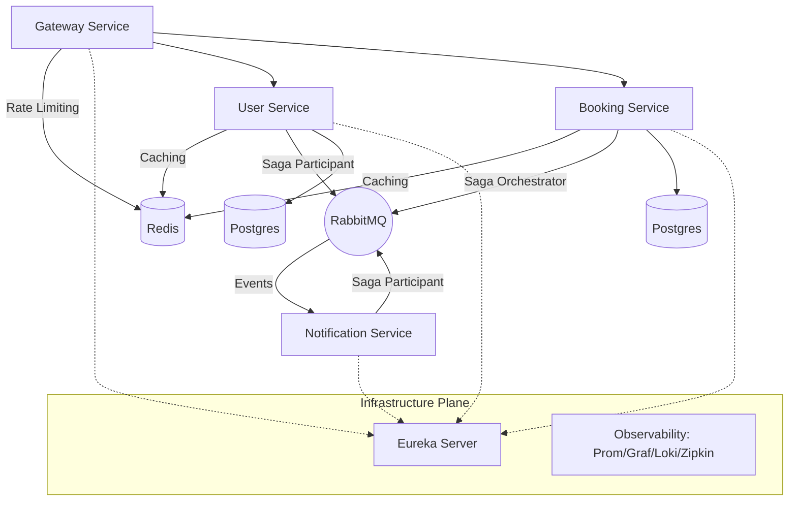

# Appointment Tracker System

Система микросервисной архитектуры для управления записью клиентов в салон красоты. Проект спроектирован с упором на отказоустойчивость, консистентность данных и наблюдаемость (observability).

## 🏗️ Архитектура

Система построена на микросервисной архитектуре и включает в себя два основных уровня:

- **Control Plane (Infrastructure):** Обеспечивает Service Discovery через **Eureka Server** и комплексный мониторинг состояния системы с помощью стека **Observability** (Prometheus, Grafana, Loki, Zipkin).
- **Data & Application Plane:** Реализует бизнес-логику, где `Booking Service` выступает в роли оркестратора паттерна **Saga**, управляя асинхронными транзакциями через **RabbitMQ**, а также интегрирует кэширование и ограничение нагрузки через **Redis**.



## 🚀 Основные особенности (Features)

- **Микросервисная архитектура**: Разделение ответственности между `user-service`, `booking-service`, `notification-service` и `gateway-service`.
- **Saga Pattern**: Реализация распределенных транзакций через брокер сообщений (RabbitMQ) для обеспечения консистентности данных при записи на прием.
- **Отказоустойчивость**: Использование Eureka Server для Service Discovery и клиентской балансировки нагрузки.
- **Производительность**: Кеширование данных пользователей и расписания в Redis с поддержкой TTL и инвалидацией данных (Cache-Aside pattern).
- **Безопасность**: API Gateway в качестве центральной точки входа, JWT-аутентификация и ограничение частоты запросов (**Rate Limiting**).
- **Observability (Мониторинг)**: Централизованный сбор логов (Loki), метрик (Prometheus + Grafana) и трейсинг запросов (Zipkin).
- **CI/CD**: Автоматизированный процесс сборки и тестирования с использованием GitHub Actions.

## 🛠️ Технологический стек

*   **Core**: Java 17/21, Spring Boot 3
*   **Microservices**: Spring Cloud (Gateway, Eureka, OpenFeign)
*   **Messaging**: RabbitMQ
*   **Database**: PostgreSQL
*   **Caching & Rate Limiting**: Redis
*   **Observability**: Prometheus, Grafana, Loki, Promtail, Zipkin
*   **Deployment**: Docker Compose
*   **CI/CD**: GitHub Actions
*   **Testing**: JUnit 5, Mockito, Testcontainers

## ⚙️ Инструкция по запуску

Для запуска всей инфраструктуры достаточно выполнить одну команду:

```bash
docker-compose up -d
```

Сервисы будут доступны на портах:
- **API Gateway**: `localhost:8080`
- **API Documentation (Swagger UI)**: `http://localhost:8080/swagger-ui.html`
- **Grafana**: `localhost:3000`
- **Prometheus**: `localhost:9090`
- **RabbitMQ Management**: `localhost:15672`

## 🛡️ Безопасность и конфигурация

*Для запуска используется файл `.env` для управления секретами (пароли к базам данных, API ключи), который исключен из системы контроля версий Git.*

## 📄 Дополнительно
Данный проект является демонстрационным, созданным для отображения навыков проектирования современных распределенных систем.
