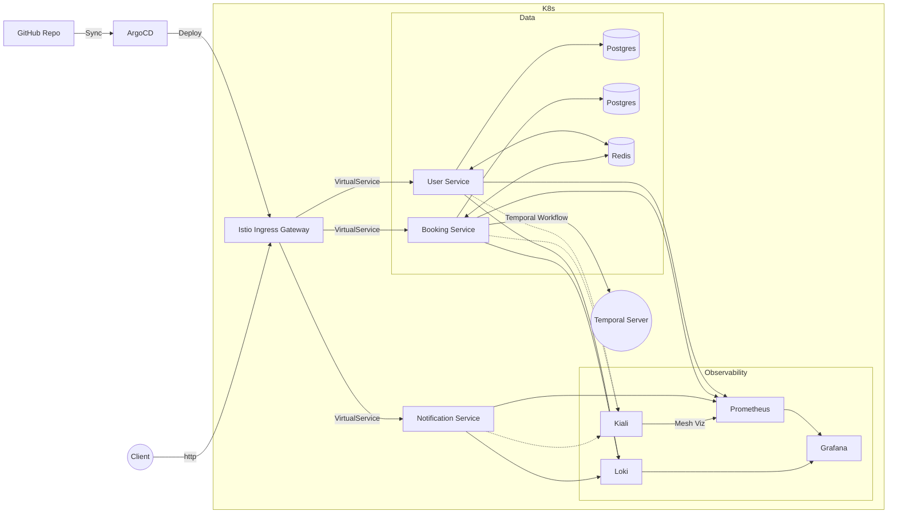

# Cloud-Native Appointment Tracker System

Система микросервисной архитектуры для управления записью клиентов в салон красоты. Проект спроектирован с упором на отказоустойчивость, безопасность и надежность оркестрации в среде **Kubernetes**.

## 🏗️ Архитектура (Modernized)

Система развернута в кластере Kubernetes с использованием **Istio Service Mesh**. Вместо классического API Gateway, оркестрация бизнес-процессов реализована на **Temporal**. Трафик управляется через Istio Ingress Gateway.



## 🚀 Основные особенности

- **Kubernetes-native**: Развертывание полностью управляется через Helm-чарты.
- **Service Mesh (Istio)**: Управление трафиком, принудительное mTLS-шифрование (STRICT mode), observability.
- **Temporal Orchestration**: Надежная оркестрация асинхронных бизнес-процессов (уведомления) с автоматическими ретраями, гарантией доставки и управлением состоянием.
- **Istio-as-Gateway**: Маршрутизация внешнего трафика напрямую в микросервисы средствами Istio VirtualService.
- **Observability**: Интегрированный стек мониторинга (Prometheus, Grafana, Loki).

## 🛠️ Технологический стек

*   **Core**: Java 21, Spring Boot 3
*   **Orchestration**: Temporal (Workflow & Activities)
*   **Infrastructure**: Kubernetes, Helm, Istio
*   **Database**: PostgreSQL
*   **Caching**: Redis
*   **Observability**: Prometheus, Grafana, Loki, Kiali

## ⚙️ Инструкция по развертыванию

1. **Подготовка кластера**:
   Убедитесь, что у вас запущен кластер Kubernetes (например, Minikube).

2. **Автоматическая настройка инфраструктуры**:
   В проекте предусмотрен скрипт для автоматизации установки Istio и ArgoCD.
   ```powershell
   # Запуск скрипта подготовки кластера (Windows PowerShell):
   .\setup_cluster.ps1
   ```

3. **Создание секретов**:
   Создайте секрет для паролей баз данных, который ожидает приложение:
   ```bash
   kubectl create secret generic db-passwords --from-literal=user-db-password=secret_password --from-literal=booking-db-password=booking_password
   ```

4. **GitOps управление с ArgoCD**:
   После успешной настройки инфраструктуры, используйте ArgoCD для развертывания приложения:
   - Откройте ArgoCD UI: `kubectl port-forward svc/argocd-server -n argocd 8080:443`
   - Перейдите на `https://localhost:8080` (логин: `admin`, пароль можно получить через команду, выведенную скриптом `setup_cluster.ps1`).
   - Добавьте репозиторий проекта и создайте Application, указав путь `salon-chart`.
   - Включите **Automatic Sync** для автоматического обновления приложения при каждом `git push`.

4. **Установка приложения (ручной метод)**:
   ```bash
   helm install salon-app ./salon-chart/
   ```

5. **Доступ к системе**:
   Запустите туннель Minikube для доступа к Ingress Gateway:
   ```bash
   minikube tunnel
   ```
   Система будет доступна по адресу `http://localhost/api/...`

## ⚖️ Управление ресурсами (Resource Management)

Для обеспечения стабильности работы кластера все микросервисы имеют настроенные `resources: requests` и `limits` (CPU/RAM). Это предотвращает ситуацию, когда один сервис может занять все ресурсы ноды, вызывая сбои в работе БД, Temporal или мониторинга.

- **Requests**: гарантированные ресурсы, необходимые для запуска пода.
- **Limits**: максимальные ресурсы, которые сервис может использовать.

Настройки ресурсов определены в файле `salon-chart/values.yaml` для каждого сервиса индивидуально. Это позволяет легко балансировать нагрузку в зависимости от реального потребления памяти и CPU.

## 🛡️ Инженерные решения
*   **Temporal вместо RabbitMQ**: Переход на Temporal позволил отказаться от сложной логики очередей и ручной реализации компенсирующих транзакций. Temporal гарантирует надежную доставку событий и управление состоянием воркфлоу, избавляя от необходимости внедрения дополнительных паттернов атомарности (Transactional Outbox).
*   **Service Mesh**: Использование Istio позволило вынести логику маршрутизации и безопасности из кода микросервисов в инфраструктурный слой.
*   **mTLS Enforcement**: Безопасность коммуникаций внутри кластера обеспечивается политикой `PeerAuthentication` в режиме `STRICT` (файл `salon-chart/templates/mtls.yaml`), что гарантирует, что весь внутренний трафик между микросервисами зашифрован и взаимно аутентифицирован.
